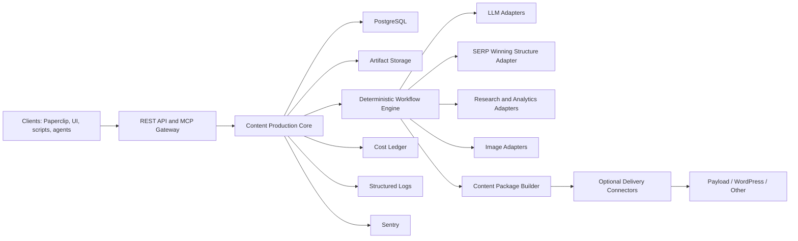

# PRD: Content Production Service

Status: Draft for architecture review

Product type: Standalone multi-tenant service

Primary interfaces: REST API and MCP server

Storage: Service-owned PostgreSQL and artifact storage

Deployment model: Independent from Paperclip and any CMS

First reference client: Astrogen through a separate Paperclip adapter

## 1. Executive Summary

Content Production Service is an independent system for planning, generating,
reviewing, formatting, packaging, and optionally delivering articles for
multiple companies, projects, languages, markets, and content types.

The service owns the content-production domain:

- project context;
- content plans and topic lifecycle;
- existing-content inventory;
- editorial, SEO, formatting, image, and quality policies;
- provider and model routing;
- generation history and revisions;
- evidence and source provenance;
- process state and recovery;
- artifacts and delivery receipts;
- token and monetary cost accounting.

The service is not part of Paperclip. Paperclip is one possible client and must
integrate through a separate adapter using the same public API/MCP contracts as
other clients.

The service does not send Telegram messages, emails, or other human
notifications. It exposes state, decisions, events, artifacts, and costs through
its API and MCP interfaces. Clients decide how to present or communicate them.

The core always produces a portable `ContentPackage` containing at least
canonical Markdown and sanitized HTML. CMS delivery is optional and performed
through pluggable delivery connectors. Payload CMS is the first supported
connector, not a dependency of the core domain.

SEO competitor research through a **SERP Winning Structure** lifecycle is
configurable per project, content type, pipeline, and job. It can be disabled,
required, selected by deterministic rules, supplied as an existing validated
result, or explicitly started by an API/MCP client.

## 2. Product Decisions

This PRD establishes the following boundaries:

1. The product is a standalone service, not a Paperclip module.
2. PostgreSQL inside the service is the source of truth for content production.
3. All project behavior is configured through versioned API/MCP-managed data.
4. Company-specific policies are project profiles, not source-code rules.
5. All outbound provider operations use typed API or MCP adapters.
6. The service never sends human-facing notifications directly.
7. The core output is a portable content package.
8. CMS support is implemented through optional delivery connectors.
9. Payload is the first connector but remains outside the core domain.
10. SERP Winning Structure is optional and policy-controlled.
11. Operational logs rotate and expire after seven days.
12. Sentry error and performance monitoring is included from the first release.

## 3. Problem

Article production commonly combines:

- company and project context;
- content planning;
- search and competitor research;
- article structure development;
- drafting and revision;
- editorial and factual quality control;
- SEO requirements;
- visual generation;
- formatting;
- CMS mapping;
- delivery and cost reporting.

When these responsibilities are implemented as loosely connected agent
conversations, the system repeatedly reloads large histories, asks LLMs to
inspect workflow state, and loses completed work after technical failures.
Company-specific rules also tend to become hard-coded into prompts and
integration code.

The product must separate:

- reusable content-production mechanics;
- configurable project policy;
- optional external research;
- optional delivery targets;
- client-specific orchestration and human communication.

## 4. Goals

### 4.1 Product Goals

1. Support multiple isolated tenants and projects.
2. Produce articles on unrelated subjects using different policies and models.
3. Store the complete project context and content lifecycle durably.
4. Allow all supported configuration through REST API and MCP.
5. Execute production as a deterministic, recoverable workflow.
6. Invoke LLMs only for bounded semantic or generative work.
7. Return portable Markdown, HTML, structured content, evidence, quality, and
   cost artifacts.
8. Optionally create or update CMS drafts through delivery connectors.
9. Expose typed decision requests without communicating with humans directly.
10. Attribute tokens and monetary costs to tenant, project, job, stage,
    provider, and model.

### 4.2 Reusability Goals

The same service must support, without code changes:

- SEO acquisition articles;
- editorial or thought-leadership articles;
- educational series;
- product and commercial articles;
- non-SEO articles;
- refreshes and substantive rewrites;
- technical or documentation content;
- content with or without images;
- export-only projects;
- Payload, WordPress, Contentful, or future CMS connectors;
- different languages, markets, brands, and publication policies.

### 4.3 Efficiency Goals

1. Use zero LLM tokens for scheduling, leases, state transitions, retries,
   schema validation, deduplication, cost calculation, and artifact lookup.
2. Build stage inputs from bounded database records and artifact excerpts.
3. Never send full process history, unrelated project context, or operational
   logs to an LLM.
4. Allow project-specific token and monetary budgets.
5. Resume from the latest valid artifact rather than regenerating completed
   work.

## 5. Non-Goals

- Acting as a company-management system.
- Embedding CEO, CMO, agent hierarchy, or Paperclip issue semantics.
- Sending Telegram, email, Slack, or other direct notifications.
- Making every article an SEO article.
- Requiring SERP Winning Structure for all content.
- Hard-coding any company's editorial policy.
- Hard-coding a language, market, article cadence, image style, layout, CTA, or
  related-content count.
- Making Payload CMS mandatory.
- Automatically publishing content by default.
- Providing a public browser CMS or editorial UI in the first release.
- Storing plaintext provider credentials in project configuration.

## 6. Terminology

### Tenant

An isolated company or organization account.

### Project

A content-producing product, brand, website, publication, or business unit
within one tenant.

### Project Context

Versioned information about the project, audience, market, products, brand,
existing content, goals, constraints, terminology, and evidence sources.

### Content Plan

A durable, versioned set of topics, clusters, priorities, schedules,
dependencies, and lifecycle states.

### Content Job

One logical request to create, rewrite, refresh, repair, translate, or adapt one
content item.

### Policy Set

A versioned collection of editorial, SEO, image, formatting, quality,
provider-routing, budget, and delivery rules.

### Pipeline Template

A versioned workflow graph defining the enabled production stages and their
typed transition requirements.

### Content Package

The portable output of a completed production job. It is independent from any
CMS and includes text, structured content, media references, metadata,
evidence, quality results, provenance, and costs.

### Delivery Connector

An optional adapter that maps a Content Package to an external destination such
as Payload CMS.

### SERP Winning Structure

An optional competitor- and SERP-informed research lifecycle used to recommend
article structure and content opportunities. It is evidence for production,
not publishable prose.

## 7. Users And Clients

### API Clients

- custom company applications;
- content operations systems;
- editorial interfaces;
- schedulers;
- CMS automation systems;
- Paperclip through a separate adapter.

### MCP Clients

- AI agents creating or managing projects;
- content strategists;
- editorial agents;
- operational agents querying job state, artifacts, decisions, and costs.

### Service Operators

- configure infrastructure, Sentry, storage, authentication, and system limits;
- do not manually advance normal production jobs.

## 8. Architecture



### 8.1 Deployable Components

1. **API/MCP Gateway**
   - authentication and authorization;
   - tenant resolution;
   - request validation;
   - rate limiting;
   - REST, MCP, artifact download, and event-stream endpoints.

2. **Workflow Orchestrator**
   - durable job state machine;
   - queues and leases;
   - stage transitions;
   - retry scheduling;
   - policy evaluation;
   - idempotency and completion gates.

3. **Workers**
   - context and evidence preparation;
   - LLM execution;
   - SERP Winning Structure lifecycle;
   - formatting and quality checks;
   - image generation;
   - package creation;
   - optional delivery.

4. **PostgreSQL**
   - canonical domain state;
   - configuration and policy versions;
   - content plans;
   - jobs, attempts, decisions, costs, and audit events.

5. **Artifact Storage**
   - content inputs and outputs;
   - Markdown, HTML, structured content, media, evidence, and reports;
   - local S3-compatible storage or configured object store.

6. **Observability**
   - structured logs with seven-day retention;
   - Sentry errors and performance traces;
   - metrics and health endpoints.

### 8.2 Communication Boundary

Allowed outbound traffic:

- configured LLM provider APIs;
- configured MCP research services;
- configured image provider APIs;
- configured delivery-connector APIs;
- Sentry ingestion API.

Forbidden direct communication:

- Telegram;
- email;
- Slack;
- owner messaging;
- arbitrary webhooks in the first release.

Clients retrieve events through REST polling, an authenticated API event
stream, or MCP resources/tools and decide how to communicate them.

## 9. Multi-Tenancy And Isolation

Every domain record must include a tenant boundary either directly or through a
tenant-owned parent.

Requirements:

- tenant-scoped authorization on every query and mutation;
- project IDs are unique within a tenant and opaque externally;
- no cross-tenant cache reuse for private context or model output;
- no cross-tenant vector, artifact, prompt, or cost data;
- provider credentials are referenced by tenant-scoped secret IDs;
- row-level security or equivalent application-enforced isolation;
- tenant/project identifiers included in audit events and traces;
- tenant content must not appear in operational log messages.

## 10. Configuration Model

### 10.1 Configuration Hierarchy

```text
system defaults
-> tenant defaults
-> project configuration
-> content-type pipeline template
-> allowlisted job overrides
-> immutable effective job snapshot
```

Higher-priority levels may override only fields declared overrideable by the
lower-level schema.

### 10.2 Configuration Entities

- `TenantSettings`
- `ProjectSettings`
- `ProjectContext`
- `AudienceProfile`
- `BrandProfile`
- `EditorialPolicy`
- `SeoPolicy`
- `SerpWinningStructurePolicy`
- `FormattingPolicy`
- `ImagePolicy`
- `QualityPolicy`
- `ProviderRoutingPolicy`
- `BudgetPolicy`
- `PipelineTemplate`
- `DeliveryProfile`
- `RetentionPolicy`

Every entity:

- has a JSON Schema;
- is versioned;
- supports draft and active states;
- records creator, activation time, and change reason;
- is manageable through REST API;
- is manageable through typed MCP tools where safe;
- can be validated without activation;
- cannot be modified in place after activation.

### 10.3 Job Configuration Snapshot

At job creation, the service resolves all effective settings and writes an
immutable snapshot.

Later project-policy changes do not alter an active job automatically. A client
may explicitly:

- continue with the original snapshot;
- create a new job revision using current policies;
- cancel and replace the job.

### 10.4 Secret Configuration

Secret values are written only through a protected secrets API.

MCP tools may:

- list safe secret metadata;
- bind an existing `secretRef`;
- validate that a required secret is available.

MCP tools may never read, return, or log plaintext secret values.

## 11. Project Context

The internal database must hold all context required to produce consistent
content without replaying conversations.

Project context includes:

- project description and business model;
- websites and publication destinations;
- markets, geographies, and languages;
- audience segments;
- products and services when relevant;
- brand voice and prohibited language;
- approved terminology and glossary;
- editorial goals and boundaries;
- factual and legal constraints;
- calls to action and allowed destinations;
- existing-content inventory;
- content ownership and canonical URLs;
- internal-link graph;
- evidence sources and freshness;
- current content plan;
- recent generation history;
- image style and visual history;
- project-specific quality requirements.

Large documents are stored as artifacts. Database context records contain
bounded summaries and artifact references.

## 12. Content Plan

### 12.1 Responsibilities

The service stores and manages:

- topic clusters;
- primary and supporting queries when applicable;
- audience and search intent;
- content role;
- priorities;
- dependencies and prerequisites;
- planned date or cadence;
- source and evidence lineage;
- duplicate and cannibalization decisions;
- internal-link requirements;
- lifecycle state;
- job and output references.

### 12.2 Topic Lifecycle

```text
proposed
-> evidence_ready
-> reviewed
-> approved
-> scheduled
-> reserved
-> in_production
-> packaged
-> delivered
-> published
-> measured
```

Alternative terminal states:

```text
rejected
duplicate
merged
cancelled
```

Topic lifecycle transitions are deterministic and version checked.

### 12.3 Content Plan Input

Content plans may be:

- created manually through API/MCP;
- imported from a file or external system;
- generated by an optional planning pipeline;
- assembled from semantic or trend services;
- updated from publication and performance evidence.

An external research result never becomes an approved topic without the
project's configured review and ownership gates.

## 13. Content Job Operations

Supported operations:

- `create`
- `rewrite`
- `refresh`
- `repair`
- `translate`
- `adapt`

### 13.1 Rewrite

A rewrite is a content operation, not a SERP Winning Structure mode.

It requires:

- source content or artifact reference;
- rewrite objective;
- preservation locks;
- allowed change scope;
- required evidence;
- target format and language;
- explicit image reuse or regeneration policy.

A rewrite may use any SERP Winning Structure mode independently:

- a substantive SEO rewrite may require a new lifecycle;
- a tone or clarity rewrite may disable it;
- a client may provide a previously completed result.

### 13.2 Refresh

A refresh uses existing content and current evidence to improve selected
sections. Policies define whether metadata, images, links, or structure may
change.

### 13.3 Repair

A repair corrects a typed defect without broad content regeneration. Examples:

- formatting schema;
- broken metadata;
- missing image;
- invalid relation;
- unsupported markup.

Repair pipelines should normally disable SERP Winning Structure.

## 14. Workflow Engine

### 14.1 Pipeline Templates

A pipeline template is a versioned, validated directed graph of stage types.

Standard stage types:

- context preparation;
- evidence collection;
- SERP Winning Structure;
- outline/brief;
- draft;
- semantic review;
- revision;
- humanization;
- quality audit;
- formatting;
- image;
- package;
- delivery.

Stages may be:

- required;
- optional by deterministic policy;
- disabled;
- supplied by an external artifact.

Cycles are forbidden except for explicitly bounded revision edges.

### 14.2 Standard Job States

```text
queued
-> preparing
-> planning
-> drafting
-> reviewing
-> formatting
-> media
-> packaging
-> delivering
-> completed
```

Waiting and terminal states:

```text
retry_wait
decision_wait
budget_wait
cancelled
failed
```

### 14.3 Stage Contract

Every stage defines:

- typed input schema;
- required artifact references;
- deterministic preconditions;
- allowed provider adapter;
- token and monetary budget;
- timeout;
- retry policy;
- typed output schema;
- completion gate;
- allowed next states.

Models and adapters return output data. They never mutate workflow state
directly.

### 14.4 Execution Guarantees

- at-least-once worker execution;
- idempotent stage attempts;
- exactly-once externally visible effects when the provider supports
  idempotency or read-after-write reconciliation;
- optimistic versioning;
- expiring leases;
- durable attempt records before outbound calls;
- artifact registration before transition;
- isolated failure per job.

## 15. SERP Winning Structure Policy

### 15.1 Purpose

SERP Winning Structure is used when competitor and search-result evidence is
material to the content objective. It must not be called merely because the
output is an article.

### 15.2 Modes

#### `off`

The lifecycle is skipped.

Typical use:

- non-SEO editorial content;
- internal communications;
- documentation;
- style-only rewrite;
- formatting or CMS repair;
- articles where the project explicitly forbids competitor-led structure.

#### `required`

The lifecycle must complete before outline or drafting.

Typical use:

- search-acquisition articles;
- SEO refreshes;
- competitive content gaps;
- target-query pages where SERP evidence is a publication requirement.

If the provider is unavailable, the job waits or fails according to project
policy. It may not silently bypass the lifecycle.

#### `conditional`

A deterministic rule engine chooses `run` or `skip`.

No LLM decides whether to spend on the lifecycle.

The engine evaluates an immutable job snapshot against ordered project rules.
Each rule contains:

- stable rule ID;
- integer priority;
- `all`, `any`, and `none` conditions;
- action: `run` or `skip`;
- human-readable reason code.

Allowed input fields include:

- `job.operation`;
- `job.contentType`;
- `job.contentIntent`;
- `job.changeScope`;
- `seo.searchOptimizationRequired`;
- `seo.targetQueriesPresent`;
- `seo.competitorResearchRequired`;
- `seo.serpEvidenceFresh`;
- `source.existingContentPresent`;
- `pipeline.stagePurpose`;
- `project.market`;
- `project.language`.

Example:

```json
{
  "mode": "conditional",
  "defaultAction": "skip",
  "rules": [
    {
      "id": "skip-minor-repair",
      "priority": 1000,
      "all": [
        { "field": "job.operation", "equals": "repair" },
        { "field": "job.changeScope", "equals": "non_substantive" }
      ],
      "action": "skip",
      "reasonCode": "NON_SUBSTANTIVE_REPAIR"
    },
    {
      "id": "run-search-acquisition",
      "priority": 900,
      "all": [
        {
          "field": "job.contentIntent",
          "equals": "search_acquisition"
        },
        {
          "field": "seo.searchOptimizationRequired",
          "equals": true
        },
        {
          "field": "seo.targetQueriesPresent",
          "equals": true
        }
      ],
      "action": "run",
      "reasonCode": "SEARCH_ACQUISITION"
    },
    {
      "id": "run-seo-refresh",
      "priority": 800,
      "all": [
        { "field": "job.operation", "in": ["refresh", "rewrite"] },
        {
          "field": "seo.competitorResearchRequired",
          "equals": true
        }
      ],
      "action": "run",
      "reasonCode": "SEO_REFRESH"
    },
    {
      "id": "skip-non-search-editorial",
      "priority": 700,
      "all": [
        {
          "field": "job.contentIntent",
          "in": ["editorial", "thought_leadership"]
        },
        {
          "field": "seo.searchOptimizationRequired",
          "equals": false
        }
      ],
      "action": "skip",
      "reasonCode": "NON_SEARCH_EDITORIAL"
    }
  ]
}
```

Evaluation rules:

1. Validate all referenced fields and operators at policy activation.
2. Sort by descending priority.
3. Evaluate conditions against the job snapshot.
4. Use the first matching rule.
5. Reject policy activation when equal-priority rules can produce conflicting
   actions for the same condition set.
6. Use `defaultAction` when no rule matches.
7. Persist matched rule ID, action, inputs, and reason code.
8. A later configuration change cannot alter the recorded decision.

#### `provided_result`

The client supplies a previously completed SERP Winning Structure result.

This mode is not specifically for rewrite. It is used when:

- another trusted system already ran the lifecycle;
- a previous compatible result is intentionally reused;
- content is migrated into the service with existing research;
- a client separates research and production into different services.

Required validation:

- supported result schema version;
- project and market compatibility;
- source provider and provenance;
- original input hash;
- creation time and freshness;
- target query/content objective compatibility;
- complete decision state;
- cost metadata when available.

The result is imported as an immutable artifact. If validation fails, the job
does not silently switch to another mode.

For a rewrite, the client still sets `job.operation=rewrite`. The supplied
result is only the research input for that operation.

#### `on_demand`

The service does not start the lifecycle automatically. It exposes a typed
decision gate to the API/MCP client.

Typical use:

- an editor wants to inspect the topic before paying for competitor research;
- interactive planning;
- canary or A/B research;
- a client controls provider spend centrally;
- research is requested only for selected jobs.

At the planning gate the client may:

- call `start_serp_winning_structure`;
- call `skip_serp_winning_structure` when policy permits;
- cancel the job.

Configuration defines:

- whether skipping is permitted;
- decision timeout;
- timeout action: `remain_waiting`, `skip`, or `fail`;
- actors/scopes allowed to decide.

The lifecycle cannot be inserted after the content structure is frozen without
creating a new job revision. Starting it after a draft exists is treated as a
new refresh/rewrite revision, not an in-place hidden change.

### 15.3 Lifecycle Operations

A configured adapter must support:

1. input validation;
2. idempotent start;
3. status retrieval;
4. versioned decision submission;
5. result retrieval.

Polling is deterministic scheduler work and never an LLM task.

### 15.4 Cost And Result Rules

- estimate before start when supported;
- enforce project and job budgets;
- one idempotency key per job revision;
- persist actual, estimated, or partial cost status;
- preserve raw result as an immutable private artifact;
- expose a bounded normalized result to later stages;
- never treat research output as ready-to-publish prose.

## 16. Provider And Model Routing

### 16.1 Provider Abstraction

The core uses capability-based ports:

- `text.generate`
- `text.revise`
- `text.review`
- `text.structure`
- `image.generate`
- `research.semantic`
- `research.analytics`
- `research.serp_winning_structure`

Adapters map these capabilities to external APIs, local CLIs, or MCP tools.

### 16.2 Routing Policy

Projects configure:

- provider and model per capability;
- fallback chain or no-fallback policy;
- maximum input and output tokens;
- maximum turns;
- timeout;
- concurrency;
- cost ceiling;
- supported languages;
- data residency constraints;
- cache policy.

No provider or model is globally hard-coded.

### 16.3 LLM Context Rules

- stage-specific context only;
- no full job event history;
- no operational logs;
- no unrelated project documents;
- no raw credentials;
- no raw provider responses unless explicitly required;
- bounded evidence excerpts with source references;
- fresh stage session by default;
- structured output where supported.

### 16.4 Output Preservation

If a provider creates a valid artifact but the adapter closeout protocol fails,
the artifact is preserved and validated before any regeneration.

Transport recovery must not repeat semantic work automatically.

## 17. Editorial, SEO, And Quality Policies

### 17.1 Editorial Policy

Configurable fields include:

- language and locale;
- tone and voice;
- audience;
- reading level;
- prohibited claims and wording;
- terminology and glossary;
- evidence requirements;
- title and heading rules;
- allowed point of view;
- inclusivity and gender-language rules;
- article length guidance;
- CTA rules;
- series and prerequisite rules;
- factual, legal, and safety constraints.

### 17.2 SEO Policy

Configurable fields include:

- enabled or disabled;
- target-query requirements;
- metadata requirements;
- canonical and indexing rules;
- ownership and cannibalization policy;
- internal-link policy;
- SERP evidence freshness;
- search-intent classification;
- refresh criteria;
- structured data requirements;
- GEO/retrievability checks;
- keyword-use boundaries.

### 17.3 Quality Policy

Configurable gates include:

- purpose fulfillment;
- evidence and claim safety;
- originality and additional value;
- substantive completeness;
- natural language;
- repetition and templating;
- source coverage;
- formatting validity;
- prohibited leakage of prompts or process text;
- custom project validators.

Each gate declares:

- deterministic or semantic implementation;
- blocking or advisory status;
- stage;
- severity;
- allowed automatic correction;
- maximum revisions.

## 18. Formatting And Layout

The service must not assume one CMS schema.

It maintains a portable structured content model and renders:

- canonical Markdown;
- sanitized HTML;
- portable JSON AST.

Formatting policy controls:

- allowed block types;
- callouts;
- tables;
- lists;
- quotes;
- headings;
- CTA placement;
- related-content count;
- link representation;
- sanitization;
- accessibility requirements.

CMS-specific mapping belongs to the delivery connector.

## 19. Image Policy

Image generation is optional per project, content type, and job.

Configuration includes:

- `disabled`, `optional`, or `required`;
- provider and model;
- target dimensions and tolerance;
- style and brand anchors;
- human/abstract/product scene rules;
- visual-history comparison;
- text-in-image rules;
- safety policy;
- generation and retry limits;
- cost budget;
- reuse policy;
- alt, caption, and credit requirements.

The service stores:

- art direction;
- provider request and result IDs;
- image artifact;
- dimensions and format;
- visual-quality findings;
- provenance;
- cost;
- reuse history.

## 20. Content Package

Every successfully packaged job returns:

```ts
type ContentPackage = {
  packageId: string;
  tenantId: string;
  projectId: string;
  jobId: string;
  revision: number;
  operation: string;
  language: string;
  title: string;
  markdownArtifactRef: string;
  htmlArtifactRef: string;
  structuredContentArtifactRef: string;
  metadata: Record<string, unknown>;
  seo?: Record<string, unknown>;
  media: MediaArtifactRef[];
  links: LinkPlan;
  relatedContentCandidates: RelatedContentCandidate[];
  evidenceReportRef: string;
  qualityReportRef: string;
  provenanceRef: string;
  configurationSnapshotRef: string;
  costSummary: CostSummary;
  createdAt: string;
};
```

Required minimum:

- canonical Markdown;
- sanitized HTML;
- portable structured content;
- title;
- quality report;
- provenance;
- cost summary.

SEO metadata, images, CTAs, and related content are present only when required
by the effective project policy.

## 21. Delivery Connectors

### 21.1 Product Boundary

The core is complete when the Content Package is created.

Delivery is an optional, separately configured stage that consumes the package.
This preserves portability without forcing every client to build another
orchestrator for reliable CMS draft creation.

### 21.2 Delivery Modes

- `export_only`
- `create_draft`
- `update_draft`
- `publish_with_approval`

`publish_with_approval` is disabled by default and may be omitted from the first
implementation.

### 21.3 Connector Interface

A connector may implement:

- `validateConfiguration`
- `validatePackage`
- `findExisting`
- `uploadAsset`
- `createDraft`
- `updateDraft`
- `readBack`
- `publish`
- `deleteDraft`

Every operation returns a typed receipt and supports idempotency or
read-after-write reconciliation.

### 21.4 Core Knowledge

The core knows only:

- connector ID and version;
- delivery mode;
- opaque target configuration reference;
- external resource reference;
- status;
- edit/view URLs as opaque strings;
- receipt and cost references.

The core does not know:

- Payload collection names;
- WordPress post schemas;
- CMS-specific relation IDs;
- CMS-specific layout blocks;
- authentication details.

### 21.5 Payload Connector

Payload is the first supported first-party connector.

It may support:

- collection and schema mapping;
- author/category/tag resolution;
- media upload;
- draft create/update;
- read-after-write verification;
- relation expansion and validation;
- edit URL return;
- optional publication with explicit approval.

Payload-specific configuration and code live in the connector package, not in
the Content Production Core.

## 22. REST API

Base path: `/v1`

### 22.1 Tenants And Projects

- `POST /tenants`
- `GET /tenants/:tenantId`
- `POST /tenants/:tenantId/projects`
- `GET /projects/:projectId`
- `PATCH /projects/:projectId`

### 22.2 Context And Policies

- `POST /projects/:projectId/context-versions`
- `GET /projects/:projectId/context-versions`
- `POST /projects/:projectId/policies/:policyType`
- `POST /projects/:projectId/policies/:policyType/:version/validate`
- `POST /projects/:projectId/policies/:policyType/:version/activate`
- `GET /projects/:projectId/effective-configuration`

### 22.3 Provider And Delivery Configuration

- `POST /projects/:projectId/provider-profiles`
- `POST /projects/:projectId/delivery-profiles`
- `POST /projects/:projectId/secret-bindings`
- `POST /projects/:projectId/integrations/:integrationId/validate`

### 22.4 Content Plans

- `POST /projects/:projectId/content-plans`
- `GET /content-plans/:planId`
- `POST /content-plans/:planId/topics`
- `PATCH /topics/:topicId`
- `POST /topics/:topicId/transitions`
- `GET /projects/:projectId/content-calendar`

### 22.5 Jobs

- `POST /projects/:projectId/jobs`
- `GET /jobs/:jobId`
- `GET /jobs/:jobId/attempts`
- `GET /jobs/:jobId/artifacts`
- `POST /jobs/:jobId/cancel`
- `POST /jobs/:jobId/retry`
- `POST /jobs/:jobId/revise`
- `POST /jobs/:jobId/decisions`

### 22.6 SERP Winning Structure

- `POST /jobs/:jobId/serp-winning-structure/start`
- `POST /jobs/:jobId/serp-winning-structure/skip`
- `POST /jobs/:jobId/serp-winning-structure/results`
- `GET /jobs/:jobId/serp-winning-structure`

### 22.7 Packages And Delivery

- `GET /jobs/:jobId/package`
- `POST /jobs/:jobId/deliveries`
- `GET /deliveries/:deliveryId`
- `POST /deliveries/:deliveryId/approve`

### 22.8 Costs And Events

- `GET /jobs/:jobId/costs`
- `GET /projects/:projectId/costs`
- `GET /projects/:projectId/events`
- `GET /projects/:projectId/event-stream`

All mutations require:

- authenticated tenant scope;
- idempotency key;
- expected version when mutating existing state;
- actor identity;
- request ID.

## 23. MCP Interface

Transport: streamable HTTP

Authentication: tenant-scoped Bearer token

Default exposure: private network or authenticated server-to-server

### 23.1 Project And Policy Tools

- `create_project`
- `get_project`
- `update_project_settings`
- `put_project_context`
- `put_policy_version`
- `validate_policy_version`
- `activate_policy_version`
- `get_effective_configuration`
- `bind_secret_reference`
- `validate_integration`

### 23.2 Content Plan Tools

- `create_content_plan`
- `get_content_plan`
- `upsert_topic`
- `transition_topic`
- `get_content_calendar`
- `list_ready_topics`

### 23.3 Job Tools

- `start_content_job`
- `get_content_job`
- `list_content_jobs`
- `cancel_content_job`
- `retry_content_job`
- `create_job_revision`
- `submit_job_decision`

### 23.4 SERP Winning Structure Tools

- `start_serp_winning_structure`
- `skip_serp_winning_structure`
- `provide_serp_winning_structure_result`
- `get_serp_winning_structure_status`

### 23.5 Artifact, Package, And Cost Tools

- `list_job_artifacts`
- `get_content_package`
- `start_delivery`
- `get_delivery_status`
- `get_job_costs`
- `get_project_costs`
- `list_project_events`

### 23.6 MCP Safety

- tools return bounded summaries and artifact references;
- large Markdown, HTML, media, and raw research are MCP resources or API
  downloads, not inline tool responses;
- no tool returns plaintext secrets;
- no tool exposes another tenant's identifiers or data;
- configuration tools validate JSON Schema before persistence;
- every mutating tool requires an idempotency key.

## 24. Data Model

Primary tables:

- `tenants`
- `projects`
- `project_context_versions`
- `audience_profiles`
- `brand_profiles`
- `policy_sets`
- `policy_versions`
- `pipeline_templates`
- `pipeline_template_versions`
- `provider_profiles`
- `delivery_profiles`
- `secret_bindings`
- `content_plans`
- `topics`
- `topic_dependencies`
- `existing_content_items`
- `content_jobs`
- `job_revisions`
- `job_configuration_snapshots`
- `job_stage_attempts`
- `job_decisions`
- `artifacts`
- `artifact_relations`
- `content_packages`
- `delivery_attempts`
- `external_operation_attempts`
- `cost_events`
- `audit_events`
- `event_outbox`

Operational logs are not stored in the domain tables.

## 25. Idempotency

Required idempotency scopes:

- project and policy mutations;
- topic transitions;
- job creation and revisions;
- every provider operation;
- SERP Winning Structure lifecycle;
- image generation;
- package generation;
- CMS create/update/publish;
- decision submission.

An external-operation record is created before a provider call and completed
after the provider receipt is durable.

If a response is lost:

1. read the attempt record;
2. query the provider or destination by idempotency key/external reference;
3. reconcile the result;
4. do not repeat the side effect until absence is proven.

## 26. Cost Accounting

### 26.1 Cost Event

```ts
type CostEvent = {
  id: string;
  tenantId: string;
  projectId: string;
  jobId?: string;
  stageAttemptId?: string;
  provider: string;
  model?: string;
  operation: string;
  inputTokens?: number;
  cachedInputTokens?: number;
  outputTokens?: number;
  providerUnits?: number;
  amountMicros?: number;
  currency: string;
  status: "actual" | "estimated" | "partial" | "unavailable";
  providerRequestId?: string;
  occurredAt: string;
};
```

### 26.2 Requirements

- estimate before paid start when supported;
- enforce tenant, project, daily, job, and stage budgets;
- preserve provider currency;
- optionally calculate a normalized reporting currency with a recorded rate;
- never report a partial amount as total actual cost;
- aggregate by project, job, stage, provider, and time window;
- expose costs through REST and MCP;
- include final cost summary in every Content Package;
- include unsuccessful paid attempts;
- distinguish cached and uncached token use.

## 27. Process Logging

### 27.1 Structured Logs

API, MCP gateway, orchestrator, workers, and connectors emit JSON logs.

Required fields:

- timestamp;
- level;
- service and component;
- environment and release;
- request ID;
- trace ID and span ID;
- tenant ID;
- project ID when available;
- job ID when available;
- stage and attempt ID when available;
- adapter and operation when available;
- duration;
- status and typed error class.

Forbidden log content:

- plaintext secrets or authorization headers;
- full prompts;
- full article bodies;
- raw MCP/provider payloads;
- personal data unless explicitly classified and redacted;
- binary artifact content.

### 27.2 Rotation And Retention

Operational process logs have a fixed retention of seven days.

Requirements:

- rotate at least daily;
- also rotate when one log file reaches 100 MiB;
- compress rotated files;
- remove files and log-store records older than seven days;
- run cleanup at least hourly;
- enforce a configurable total local-log disk cap;
- emit an alert before the cap is exhausted;
- write application logs to stdout in containers;
- configure the container runtime or log collector with equivalent rotation and
  seven-day retention;
- verify retention in deployment smoke tests.

Seven-day retention applies to operational logs only.

The following are durable domain records and use separate project/system
retention policies:

- audit events;
- cost events;
- decisions;
- artifacts;
- content packages;
- delivery receipts;
- configuration versions.

### 27.3 Log Access

Raw operational logs are operator-only and are not returned through normal
project MCP tools.

The API may expose bounded, sanitized diagnostic summaries for authorized
operators. Clients receive typed job errors and events rather than raw logs.

## 28. Sentry

Sentry is required in the first release for:

- API errors;
- MCP gateway errors;
- worker exceptions;
- adapter and connector failures;
- performance transactions;
- distributed traces across API, queue, worker, and external attempt;
- release and environment tracking.

### 28.1 Configuration

- DSN stored as a deployment secret;
- environment and release required;
- `sendDefaultPii=false`;
- request bodies disabled or scrubbed by default;
- authorization, cookies, secrets, prompts, article content, and raw provider
  payloads removed in `beforeSend`;
- tenant/project/job IDs may be tags, but titles and content may not;
- 100 percent capture for unhandled errors;
- configurable trace sampling, default 10 percent in production;
- higher sampling allowed for failed or slow jobs;
- source maps/debug symbols uploaded during release;
- trace context propagated through queues and adapters.

### 28.2 Error Classification

Sentry issues must include typed classes:

- validation;
- authentication;
- authorization;
- provider timeout;
- provider rate limit;
- provider budget;
- malformed provider response;
- artifact storage;
- database;
- workflow invariant;
- delivery reconciliation;
- unknown.

Expected user/configuration validation errors should not create noisy Sentry
issues unless their rate crosses a configured threshold.

### 28.3 Sentry And Log Separation

Sentry is not the primary log store.

- operational logs retain seven days;
- Sentry stores errors and sampled traces according to the configured Sentry
  project retention;
- durable business audit and cost records remain in PostgreSQL;
- an operator must be able to correlate all three using request, trace, job,
  and attempt IDs.

## 29. Audit Events

Audit events record business and configuration actions:

- policy creation and activation;
- project-context changes;
- topic decisions;
- job creation, revision, cancellation, and completion;
- budget decisions;
- provided SERP Winning Structure imports;
- delivery approvals;
- connector side effects.

Audit records are append-only and are not subject to seven-day operational-log
retention.

## 30. Error And Recovery Policy

Every failure is classified:

- `retryable`;
- `non_retryable`;
- `decision_required`;
- `budget_required`;
- `configuration_required`.

### 30.1 Retryable

Examples:

- timeout;
- transient 5xx;
- rate limit;
- queue interruption;
- lost response with reconcilable external operation.

Action:

- bounded exponential backoff with jitter;
- same idempotency key;
- same completed artifacts;
- circuit breaker per provider/project.

### 30.2 Non-Retryable

Examples:

- invalid policy;
- unsupported schema;
- prohibited content;
- incompatible supplied artifact.

Action:

- stop affected job;
- expose typed error and required correction;
- do not retry with a larger model automatically.

### 30.3 Decision Required

The job enters `decision_wait` and exposes:

- decision type;
- clear alternatives;
- evidence references;
- recommended default when policy allows;
- expiration behavior.

The service does not contact a human.

### 30.4 Isolation

- one blocked job does not consume active worker capacity indefinitely;
- one provider circuit breaker does not pause unrelated providers;
- one tenant incident does not expose or halt another tenant;
- content-plan scheduling continues around isolated failures when policy permits.

## 31. Security

- TLS for all API and MCP traffic;
- tenant-scoped service credentials;
- short-lived tokens where supported;
- encrypted secret store;
- encryption at rest for database and artifact storage where available;
- strict outbound allowlist for provider/connector endpoints;
- SSRF protection;
- content-type and size validation for uploads;
- malware scanning for untrusted binary uploads when enabled;
- audit trail for privileged changes;
- configurable artifact retention and deletion;
- no raw secrets in logs, Sentry, artifacts, or prompts.

## 32. Observability And Metrics

Required metrics:

- jobs created, completed, failed, and cancelled;
- stage latency p50/p95/p99;
- queue age and lease recovery;
- retries by typed class;
- decision-wait age;
- artifacts created and reused;
- LLM tokens by provider/model/stage;
- cached versus uncached input;
- monetary costs;
- SERP Winning Structure run/skip decisions by rule;
- image attempts and reuse;
- package and delivery success;
- connector reconciliation;
- Sentry error rate;
- log storage usage and retention cleanup status.

Health endpoints:

- `/health/live`
- `/health/ready`
- `/health/dependencies`

Dependency health must distinguish required core dependencies from optional
providers and connectors.

## 33. SLOs

Default service SLOs:

- 99.9 percent API availability excluding planned maintenance;
- 99 percent deterministic transition success without operator intervention;
- 99 percent external side effects have one durable reconciled receipt;
- zero cross-tenant data exposure;
- zero plaintext secrets in logs or Sentry;
- 95 percent of normal jobs complete within the project-configured target;
- 100 percent of completed jobs return a cost summary;
- 100 percent of process logs older than seven days are deleted;
- no automatic publication without an active delivery policy and required
  approval.

Per-project throughput, latency, token, cost, and quality targets are
configuration, not global product constants.

## 34. Paperclip Adapter

The Paperclip adapter is a separate package and deployable integration.

Responsibilities:

- map a Paperclip company/project to a service tenant/project;
- create or update project settings through API/MCP;
- submit content-plan and job requests;
- project service job states into Paperclip cases;
- surface typed decisions;
- import artifact, package, and cost references;
- translate service events into Paperclip-specific notifications when desired.

The adapter must not:

- make Paperclip the content source of truth;
- send issue histories as LLM context;
- bypass service policy or job transitions;
- duplicate provider calls;
- duplicate CMS delivery;
- write service secrets into Paperclip comments or configuration.

## 35. Reference Project Profiles

Company-specific profiles live outside this product PRD. They document how an
existing project is represented through the public configuration contracts and
must not introduce project rules into core code.

The first companion profile is:

- `.planning/company/astrogen/CONTENT_PRODUCTION_SERVICE_PROJECT_PROFILE.md`

The profile is applied through REST API/MCP during project bootstrap. It is not
loaded from the source tree by the running service.

## 36. Rollout

### Phase 1: Core Domain

- tenant/project model;
- policy and context versioning;
- content plans;
- jobs and workflow engine;
- artifact store;
- cost ledger;
- REST API and MCP gateway;
- seven-day structured logging;
- Sentry.

### Phase 2: Text Production

- provider abstraction;
- draft, review, revision, quality, and formatting stages;
- portable Content Package;
- configurable pipelines;
- token budgets and context limits.

### Phase 3: Research And Images

- SERP Winning Structure adapter and all modes;
- semantic/analytics adapter interfaces;
- image adapters and policies;
- provider cost reconciliation.

### Phase 4: Delivery Connectors

- generic connector SDK;
- Payload connector;
- read-after-write reconciliation;
- draft-only canary.

### Phase 5: Paperclip Adapter And Astrogen Canary

- bootstrap Astrogen project profile through API/MCP;
- import selected content plan, context, and history;
- run shadow jobs;
- compare quality, cost, duration, and artifacts;
- run a three-article draft-only canary;
- cut over only after acceptance.

## 37. Acceptance Criteria

1. The service runs without Paperclip installed or available.
2. Two tenants can produce unrelated articles without sharing context or cache.
3. A new project can be fully configured through REST API.
4. An authorized MCP client can configure policies using typed tools and secret
   references.
5. Project policy changes produce new versions and do not mutate active jobs.
6. The database stores project context, content plan, generation history,
   policies, artifacts, decisions, and costs.
7. A non-SEO article completes with SERP Winning Structure set to `off`.
8. A search-acquisition article runs it under `required`.
9. `conditional` records the exact matched rule and deterministic input.
10. `provided_result` imports a valid result and is demonstrably independent
    from `job.operation=rewrite`.
11. `on_demand` waits for an API/MCP start or skip decision according to policy.
12. A job always returns Markdown, HTML, portable structured content, quality,
    provenance, and cost artifacts.
13. The core completes successfully without a CMS connector.
14. The Payload connector can idempotently create and verify a draft.
15. No service component sends Telegram or email.
16. Every paid provider attempt records actual, estimated, partial, or
    unavailable cost status.
17. A worker restart does not duplicate provider, image, or CMS side effects.
18. Operational logs are structured, rotated, compressed, and deleted after
    seven days.
19. Sentry captures a forced worker exception with release, environment, trace,
    project, job, and attempt correlation but no prompt, article, or secret.
20. Astrogen behavior can be reproduced entirely from project configuration and
    external adapter bindings.

## 38. Required Verification Scenarios

1. Non-SEO editorial article with no SERP or image stage.
2. SEO article with required SERP Winning Structure.
3. Conditional rule runs research for search acquisition.
4. Conditional rule skips research for a non-substantive repair.
5. Provided research result for a new article.
6. Provided research result for a rewrite.
7. On-demand start, skip, and timeout behavior.
8. Rewrite preserving locked facts and links.
9. Image-disabled project.
10. Image-required project with one retry.
11. Export-only Content Package.
12. Payload draft create with lost response and reconciliation.
13. Two simultaneous tenants using different policies and models.
14. Provider authentication failure isolated to one integration.
15. Project budget exhaustion with other projects continuing.
16. Process-log rotation by day and by size.
17. Automatic removal of logs older than seven days.
18. Sentry redaction of prompts, content, credentials, and provider payloads.
19. Paperclip unavailable while direct API production continues.
20. Paperclip adapter reconnect and state projection without duplicated work.
