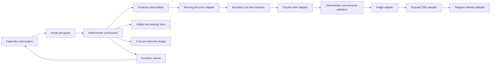

# PRD: Astrogen Deterministic Article Production Module

Status: Draft for architecture review  
Owner: Chief Technical Officer  
Business owner: Chief Marketing Officer  
Control plane: Paperclip  
Default delivery mode: Payload CMS draft, never automatic publication  
Target throughput: 3 complete CMS drafts per Europe/Kyiv working day

## 1. Executive Summary

Astrogen needs a dedicated article-production module inside Paperclip that
preserves the existing editorial, SEO, evidence, image, CMS, and governance
policies while removing LLM calls from workflow coordination.

The module is a deterministic, durable state machine. It owns scheduling,
leases, retries, idempotency, schema validation, artifact storage, adapter
calls, completion gates, and delivery receipts. LLMs are invoked only for
bounded semantic work: article strategy, writing, substantive review, and
editorial improvement.

Paperclip remains the company control plane:

- CEO and CMO set goals, portfolio policy, and exception authority;
- native pipeline cases expose status, evidence, costs, and decisions;
- agents perform specialist judgment only when the stage requires it;
- the module executes the production process and resumes it automatically.

The module must reduce recorded ChatGPT token use from the current operational
order of tens of millions per delivered article to a target of 50,000-120,000
ChatGPT tokens per article when Claude remains the primary writer. External
provider usage is accounted separately.

## 2. Problem

The current article pipeline has strong business rules but uses agent
heartbeats as the transport between too many stages. This creates:

- repeated loading of large agent, issue, company, and historical contexts;
- LLM calls for state inspection, counting, routing, and transition decisions;
- hourly or monitor-driven gaps between already completed stages;
- repeated work after protocol, permission, schema, or adapter failures;
- manager agents spending tokens on operational supervision;
- inconsistent recovery when a single case is blocked;
- provider calls retried without one central attempt and cost policy;
- completion claims that can diverge from CMS and notification evidence.

Observed baseline for 20-25 July 2026:

- 830,011,402 recorded OpenAI/ChatGPT tokens;
- 12 article-production cases reached `delivered`;
- approximately 69.2 million recorded ChatGPT tokens per delivered case when
  all company management and SEO activity is allocated to delivered output;
- 92.5 percent of input tokens were cached, which lowers compute cost but still
  consumes recorded context and subscription capacity.

The module must remove orchestration token use without weakening article
quality or silently bypassing external evidence.

## 3. Goals

### 3.1 Product Goals

1. Produce three complete, independently valid CMS drafts per day when three
   dispatchable topics exist.
2. Complete a normal article from reservation to CMS delivery in 15-45 minutes.
3. Continue unrelated article jobs when one job is blocked.
4. Resume from the last valid artifact after transient failures.
5. Preserve all current Astrogen editorial and SEO policies.
6. Provide one canonical status, evidence, cost, and delivery history.
7. Keep CEO and CMO in management roles rather than stage-execution roles.

### 3.2 Efficiency Goals

1. Use zero LLM tokens for scheduler ticks, queue inspection, leases, dedupe,
   transitions, retries, schema checks, CMS verification, and notifications.
2. Limit a standard article to:
   - at most one Claude drafting call;
   - at most four bounded ChatGPT semantic calls before exception review;
   - at most one automatic substantive revision;
   - at most one paid image generation, with one CMO-authorized corrective
     generation only after a proven hard visual defect.
3. Target 50,000-120,000 ChatGPT tokens per delivered article while Claude is
   the primary writer.
4. Target 215,000-430,000 ChatGPT tokens per day for three articles plus shared
   portfolio work.

### 3.3 Reliability Goals

1. At-least-once job execution with exactly-once externally visible effects.
2. No duplicate Winning Structure runs, images, CMS drafts, or notifications.
3. No article may reach `delivered` without verified CMS and message receipts.
4. Retryable technical failures must not require owner intervention.
5. Authentication, authorization, provider-budget, and policy failures must
   fail closed and use a clear exception path.

## 4. Non-Goals

- Replacing Paperclip as the company control plane.
- Changing the approved 12/5/3/3/2 content portfolio policy.
- Weakening topic ownership, cannibalization, evidence, curriculum,
  one-concept, Winning Structure, image, CTA, or related-post requirements.
- Treating trend topics as accepted semantic-core keywords.
- Publishing articles automatically in the first release.
- Enabling Telegram proactive watches.
- Using Claude for any role other than primary article writing.
- Replacing Semantic Core, Winning Structure, Payload CMS, image generation,
  GSC/GA4, CrawlObserver, Telegram, or email providers.
- Maintaining the old agent-per-transition article workflow after cutover.

## 5. Users And Responsibilities

### Chief Marketing Officer

- owns daily article capacity and portfolio balance;
- approves bounded exception decisions;
- receives a concise daily outcome summary;
- verifies business delivery policy, not technical transitions;
- does not write, format, upload, or manually advance articles.

### Chief Executive Officer

- reviews company outcomes and unresolved cross-functional risks;
- does not participate in routine article production.

### Content Specialists

- Content Strategist: prepares bounded strategy input when code cannot derive it
  from approved evidence.
- Claude Writer: writes or substantively revises the article.
- Article Validator: performs semantic and editorial judgment.
- Humanizer: performs one bounded naturalness pass.
- Image Runtime Executor: supplies typed art direction only when generation is
  required.

### System Operators

- CTO owns runtime, adapters, schemas, SLOs, and incident recovery;
- normal production must not depend on an operator manually waking agents or
  patching database state.

## 6. Product Principles

1. **Code moves work; models change meaning.**
2. **Artifacts, not conversations, are stage handoffs.**
3. **One article job is the durable unit of work.**
4. **Every external side effect has an idempotency key.**
5. **A failed case is isolated from the batch.**
6. **Retries reuse completed evidence and artifacts.**
7. **Managers see exceptions and outcomes, not protocol noise.**
8. **Provider cost is recorded at the call boundary.**
9. **No hidden compatibility path after production cutover.**

## 7. Target Architecture



### 7.1 Components

#### Article Orchestrator

- event-driven worker with a durable queue;
- reads and writes native Paperclip pipeline cases;
- obtains a lease for one stage attempt;
- calculates the next deterministic transition;
- invokes adapters and bounded LLM tasks;
- records artifacts and receipts before advancing;
- schedules retries without creating duplicate tasks.

#### Evidence Pack Builder

- resolves references from topic inventory, Semantic Core, GSC/GA4, CMS
  ownership inventory, curriculum, content policy, and Winning Structure;
- stores immutable, versioned evidence snapshots;
- passes only the fields required by the current stage;
- never embeds issue threads or whole agent histories.

#### Bounded LLM Task Executor

- accepts a typed task schema, artifact references, input token budget, output
  schema, timeout, and idempotency key;
- creates a fresh or stage-scoped session;
- rejects outputs outside the expected schema;
- never lets a model perform pipeline transitions or direct external writes;
- records input, cached input, output, model, adapter, duration, and cost.

#### Adapter Gateway

- provides one common interface for all external systems;
- enforces company scope, secret resolution, request limits, idempotency,
  timeout, retry class, circuit breaker, and cost accounting;
- returns client-safe typed results, never raw MCP or provider payloads to
  agents.

#### Artifact Store

- stores immutable input and output documents separately from case fields;
- keeps case fields compact and reference-only;
- supports content hashes and provenance;
- allows a failed stage to resume without regenerating earlier artifacts.

## 8. Article Job State Machine

The internal state machine is intentionally smaller than the current
agent-facing stage list.

```text
queued
-> evidence_ready
-> structure_ready
-> draft_ready
-> editorial_ready
-> media_ready
-> cms_ready
-> delivered
```

Side states:

```text
retry_wait
exception_review
cancelled
```

### 8.1 State Responsibilities

| State | Required durable output | LLM allowed |
|---|---|---:|
| `queued` | valid topic reservation and job policy snapshot | No |
| `evidence_ready` | compact evidence pack and ownership decision | Only for unresolved semantic classification |
| `structure_ready` | imported Winning Structure result and accepted brief | Yes |
| `draft_ready` | canonical Claude draft | Claude only |
| `editorial_ready` | validated, humanized, MC-approved article and layout | Yes, bounded |
| `media_ready` | approved or reused attachment-backed cover | Only for art-direction judgment |
| `cms_ready` | authenticated CMS draft verification receipt | No |
| `delivered` | Telegram receipt and final completion proof | No |

Current Paperclip UI stages may remain as projections for observability, but
they must not each create an independent manager heartbeat. Stage projections
are updated by the orchestrator from the canonical job state.

## 9. Functional Requirements

### FR-01: Daily Capacity And Dispatch

- At 08:30 Europe/Kyiv, deterministic capacity planning checks the next three
  days.
- A healthy buffer contains at least nine independently dispatchable topics.
- At 10:00, the module reserves up to three topics that satisfy portfolio,
  family, ownership, cannibalization, and curriculum constraints.
- Three jobs run independently and may progress in parallel.
- A missing topic starts the appropriate refill lane before 10:00; it does not
  create a fake article or weaken editorial policy.
- Blocked and `retry_wait` jobs do not consume productive WIP.

### FR-02: Topic And Evidence Intake

- Input must be a canonical topic-inventory case with stable topic key,
  lineage, portfolio track, intent cluster, primary query, supporting queries,
  ownership decision, internal-link plan, and evidence references.
- Trend topics remain audience-first and cannot be narrowed into Astrogen
  products in title, H1, slug, primary query, or topic key.
- Western astrology curriculum topics enforce one article/one new concept.
- Semantic Core is an upstream evidence source, not a mandatory keyword gate
  for curriculum prerequisites that have an approved topical-authority role.
- Calendar/date horoscope topics remain excluded.

### FR-03: Winning Structure Lifecycle

- The module must use exactly one idempotent Winning Structure lifecycle per
  article task revision.
- Input validation happens before a paid start.
- A paused run resumes with the same namespace, run ID, and input hashes.
- Decisions create a new decision-set version without starting a second run.
- Results and cost evidence are imported before retention expiry.
- Winning Structure output is recommendation evidence, never publishable prose.

### FR-04: Primary Writer

- Claude CLI/local adapter is the only primary article writer.
- The writer receives only:
  - accepted brief;
  - selected Winning Structure sections;
  - evidence excerpts and claim boundaries;
  - relevant prerequisite content;
  - editorial policy subset;
  - required output schema.
- Maximum one normal draft call.
- One substantive revision may reuse the original draft and finding list.
- A protocol or transport failure resumes the same attempt and does not ask
  Claude to rewrite the article.
- OpenRouter/OpenCode must not be selected for normal writing.

### FR-05: Editorial Validation

Deterministic checks run before semantic validation:

- required title, H1, slug, SEO metadata;
- Ukrainian script and forbidden technical residue;
- articleContent-compatible structure;
- CTA and internal-link targets;
- exactly three eligible related-post candidates;
- one-concept curriculum constraints when applicable;
- artifact completeness and content hashes.

Semantic checks then evaluate:

- task fulfillment and reader value;
- evidence and claim boundaries;
- substantive differentiation;
- cannibalization compliance;
- natural Ukrainian;
- accepted Winning Structure;
- one-concept teaching depth;
- non-fatalistic and non-diagnostic wording.

Failures return typed findings. Only substantive findings may invoke a writer
revision. Layout/schema findings are repaired by code or the layout component.

### FR-06: Humanization And Main Content Quality

- One bounded humanizer call is allowed.
- It may change prose surface but not evidence, claims, structure IDs, SEO
  locks, CTA targets, or selected value units.
- MC quality runs once after humanization.
- One finding-bounded surface correction is allowed without returning to the
  writer.
- A second substantive failure moves the job to `exception_review`.

### FR-07: Layout

- Canonical `articleContent.v1` construction should be deterministic wherever
  source sections already have typed roles.
- The first editorial callout is `Коротко` with variant `soft`.
- The final body contains one quiet CTA and exactly three resolved related
  posts.
- Paragraph text/spans, allowed icons, two-column completeness, metadata, and
  relations are schema-validated before CMS.
- Layout repair must never trigger article regeneration.

### FR-08: Cover Image

- A valid existing image is reused for refresh/repair jobs unless the job
  explicitly scopes an image defect.
- New articles call visual-history lookup before generation.
- Default provider model is company-configurable.
- Normal path allows one paid image.
- Requested size is 1472x822.
- Actual width and height may each deviate by at most 20 percent when visual QA
  passes; no retry, upscale, stretch, or destructive crop is allowed for a
  within-tolerance mismatch.
- A second generation requires a proven hard visual defect and one recorded CMO
  authorization.
- All generated or reused covers become attachment-backed work products.

### FR-09: Payload CMS Draft

- CMS mutation starts only after deterministic article-content validation.
- The module searches by canonical slug before create.
- Existing matching drafts are verified and reused idempotently.
- New drafts use one typed create call; refreshes use one typed update call.
- The module uploads accepted media, resolves approved author/category
  relations, sets CTA and exactly three related posts, and refetches with
  `depth=1`.
- Completion requires three distinct expanded related-post objects with
  `_status=published`, `workflowStatus=approved`, and `noindex=false`.
- Cover and OG media, article content, metadata, CTA, and `Коротко` are verified.
- The CMS record remains `draft`.
- `cmsAdminUrl` must be the adapter-returned admin URL.

### FR-10: Delivery

- The module sends one gender-neutral Ukrainian Telegram message.
- The message contains the article title and CMS admin edit URL only.
- Idempotency prevents duplicate delivery.
- Technical diagnostics never go to the owner Telegram channel.
- Email is reserved for weekly reports, sustained incidents, authentication,
  budget, or explicit owner decisions; it is not a normal stage notification.

### FR-11: Recovery

- Every stage attempt has `retryable`, `non_retryable`, or
  `decision_required` classification.
- Retryable failures use bounded exponential backoff with jitter.
- The same artifact and idempotency key are reused.
- Provider circuit breakers pause only the affected adapter and cases.
- Authentication refresh failure pauses affected LLM work, sends one concise
  Telegram/email notice, and starts the supported refresh procedure.
- A blocked case cannot block another case or the daily allocator.
- Recovery never creates a second logical article job.

### FR-12: Owner And Manager Escalations

Owner action is required only for:

- editorial/business-policy decisions outside delegated authority;
- acceptance of cannibalization, merge, ownership, or canonical changes;
- explicit publication approval if auto-publication is enabled later;
- provider spend above approved budget;
- credentials that require human authentication.

Technical schema, permission, adapter, retry, or deployment failures are CTO
work and must not be written as owner decision requests.

## 10. External Systems And Adapter Contracts

### 10.1 Semantic Core And Trend MCP

Plugin: `paperclip.semantic-core-mcp-agent-tools`

Use:

- upstream topic inventory, ownership, keyword clusters, trend hypotheses, and
  bounded content evidence;
- not on every article hot path when the accepted topic already has a valid,
  unexpired evidence snapshot.

Relevant operations:

- `register-project`
- `validate-project`
- `run-layer` / `run-layer-and-wait`
- `get-job-status`
- `request-content-parsing`
- `get-keywords`
- `get-clusters`
- `get-serp-segments`
- `generate-trend-topic-report`
- `get-review-queue`
- `submit-review-decisions`
- `get-run-costs`

Rules:

- Bearer token remains a company-scoped Paperclip secret;
- autonomous paid candidate batches contain 1-10 exact phrases;
- each external SERP query is at most four words;
- Standard queue only;
- Search Intent enrichment and inline parsing are disabled for autonomous runs;
- content parsing is a separate bounded request for 1-3 public URLs;
- trend reports never call `prepare-paperclip-import`;
- trend candidates do not become accepted keywords or articles directly;
- cache and numeric provider cost telemetry are persisted.

### 10.2 GSC, Bing, And GA4 MCP

Plugin: `paperclip.gsc-bing-ga4-mcp-agent-tools`

Use:

- build daily or weekly evidence snapshots;
- provide query-to-URL, landing-page, conversion, and demand context;
- avoid live calls from each article stage.

The module consumes a bounded cached snapshot by reference. Missing fresh
analytics is a warning unless the topic policy explicitly requires it.

### 10.3 CrawlObserver

Plugin: `paperclip.crawlobserver-agent-tools`

Use:

- sitewide technical evidence and post-publication verification;
- not a normal prerequisite for writing a CMS draft.

Only trusted crawl sessions may be cited as technical proof.

### 10.4 Winning Structure MCP

Plugin: `paperclip.winning-structure-mcp-agent-tools`

Required lifecycle:

1. `validate-task-input`
2. `start-winning-structure-run`
3. `get-run-status`
4. `submit-run-decisions` when required
5. `get-run-result`

Rules:

- private network endpoint and company-scoped secret;
- one idempotency key per article case and task revision;
- polling is performed by deterministic scheduler code, not an LLM heartbeat;
- provider-reported actual or eligible estimated costs enter the ledger;
- partial cost is evidence only, not a false total;
- raw MCP payloads remain in immutable artifacts.

### 10.5 Claude Writer

Adapter: `claude_local`

Use:

- initial article draft;
- at most one substantive revision.

Rules:

- subscription-backed CLI authentication;
- no OpenRouter fallback on ordinary quota or protocol errors;
- no shell, CMS, Telegram, or pipeline-transition authority;
- typed input and output artifact contract;
- bounded turns and timeout;
- output artifact is preserved even if closeout protocol fails.

### 10.6 OpenAI/ChatGPT

Adapter: `codex_local`

Use:

- bounded strategy judgment when required;
- article validation;
- bounded humanization;
- final MC quality judgment.

Rules:

- no timer heartbeat;
- no manager polling;
- one fresh stage session or compact resumable session;
- no company-wide issue history;
- hard input/output token budgets;
- schema-constrained outputs.

### 10.7 OpenRouter Image

Plugin: `paperclip.openrouter-image-agent-tools`

Operations:

- `image-visual-history-get`
- `generate-image`

Rules:

- model is company-configurable;
- one image per request;
- one normal paid call;
- one authorized corrective call after a hard defect;
- provider-reported cost and media provenance are recorded.

### 10.8 Payload CMS

Plugin: `paperclip.payload-cms-agent-tools`

Required operations:

- `payload_cms_find_blog_post`
- `payload_cms_validate_article_content`
- `payload_cms_ensure_author`
- `payload_cms_upload_media`
- `payload_cms_create_blog_post_draft`
- `payload_cms_update_blog_post_draft`

Optional recovery operations:

- `payload_cms_cleanup_technical_blog_post_draft`
- `payload_cms_delete_owner_rejected_blog_post_draft`

`payload_cms_publish_blog_post` remains disabled in the first release.

### 10.9 Telegram

Plugin: `paperclip-plugin-telegram`

Operation:

- `telegram_send_message`

Rules:

- proactive watches remain disabled;
- one owner-facing delivery message per article;
- technical events remain in Paperclip and observability logs.

### 10.10 Email

Plugin: `paperclip.email-notifications`

Use:

- authentication and sustained production incidents;
- weekly plain-language HTML outcome reports;
- owner decisions that cannot be represented by a Paperclip interaction.

All recipients are explicitly configured, with the owner email included only as
a default.

## 11. Data Model

### 11.1 Article Job

```ts
type ArticleJob = {
  id: string;
  companyId: string;
  caseId: string;
  topicCaseId: string;
  topicKey: string;
  operation: "create" | "refresh" | "repair";
  taskRevision: number;
  state:
    | "queued"
    | "evidence_ready"
    | "structure_ready"
    | "draft_ready"
    | "editorial_ready"
    | "media_ready"
    | "cms_ready"
    | "delivered"
    | "retry_wait"
    | "exception_review"
    | "cancelled";
  policySnapshotId: string;
  lease?: {
    owner: string;
    token: string;
    expiresAt: string;
  };
  attemptCounts: Record<string, number>;
  nextAttemptAt?: string;
  blocker?: TypedBlocker;
  createdAt: string;
  updatedAt: string;
  version: number;
};
```

### 11.2 Artifact Reference

```ts
type ArtifactRef = {
  key: string;
  revision: number;
  contentHash: string;
  mediaType: string;
  storageRef: string;
  producer: string;
  sourceAttemptId: string;
  createdAt: string;
};
```

### 11.3 External Attempt

```ts
type ExternalAttempt = {
  id: string;
  jobId: string;
  stage: string;
  adapter: string;
  operation: string;
  idempotencyKey: string;
  requestHash: string;
  status: "started" | "succeeded" | "retryable_failed" | "failed";
  providerRequestId?: string;
  resultArtifactRef?: string;
  usage?: {
    inputTokens?: number;
    cachedInputTokens?: number;
    outputTokens?: number;
    amountMicros?: number;
    currency?: string;
    actualOrEstimated?: "actual" | "estimated" | "partial";
  };
  startedAt: string;
  completedAt?: string;
};
```

## 12. Internal API And Events

### 12.1 Internal API

- `POST /api/companies/:companyId/article-jobs`
- `GET /api/article-jobs/:jobId`
- `GET /api/article-jobs/:jobId/artifacts`
- `POST /api/article-jobs/:jobId/cancel`
- `POST /api/article-jobs/:jobId/retry`
- `POST /api/article-jobs/:jobId/decisions`
- `GET /api/companies/:companyId/article-capacity`

All mutations require company scope, expected version, actor identity, and
idempotency key.

### 12.2 Events

- `article.job.created`
- `article.stage.ready`
- `article.stage.completed`
- `article.stage.retry_scheduled`
- `article.exception.created`
- `article.cms_draft.verified`
- `article.delivery.completed`
- `article.job.cancelled`

Event consumers must be idempotent. Events contain references and compact
summaries, not full article bodies.

## 13. Context And Token Budgets

### 13.1 Context Rules

- Maximum normal LLM input: 30,000 tokens.
- Maximum writer input: 40,000 tokens.
- Maximum output: task-specific and explicitly configured.
- No issue comments, heartbeat history, raw provider JSON, or unrelated company
  context in an LLM request.
- Large evidence is summarized deterministically and attached by selected
  excerpts with source references.
- Each stage receives the minimum policy subset required for that stage.

### 13.2 Standard Article Budget

| Work | ChatGPT tokens | Claude tokens |
|---|---:|---:|
| Strategy/brief judgment | 10k-25k | 0 |
| Draft | 0 | 20k-40k |
| Validation | 10k-20k | 0 |
| Humanization | 10k-20k | 0 |
| MC quality/final judgment | 10k-20k | 0 |
| One bounded correction allowance | 10k-35k | 0-30k |
| **Target total** | **50k-120k** | **20k-70k** |

Daily shared topic and analytics synthesis target: 50,000-100,000 ChatGPT
tokens, not one copy per article.

Budget exhaustion moves only the affected job to `exception_review`; it does not
silently increase the budget or halt unrelated work.

## 14. Idempotency

Required keys:

- article job: `article:{topicKey}:{taskRevision}`;
- Winning Structure: `winning-structure:{jobId}:{taskRevision}`;
- Claude draft: `claude-draft:{jobId}:{draftRevision}`;
- image: `cover:{jobId}:{imageRevision}`;
- CMS create/update: `cms-draft:{jobId}:{contentHash}`;
- Telegram delivery: `article-delivery:{jobId}:{cmsDraftId}`;
- email incident: `article-incident:{incidentClass}:{incidentWindow}`.

An idempotency record is written before the external call and completed after
the receipt is durable.

## 15. Error And Recovery Policy

| Failure | Automatic action | Owner notified |
|---|---|---:|
| Timeout/5xx/rate limit | retry with backoff and same key | No |
| LLM malformed output | one schema-repair pass using same artifact | No |
| Claude closeout/protocol failure with valid draft | register preserved draft and continue | No |
| CMS schema failure | return to deterministic layout repair | No |
| Missing CMS permissions | CTO incident and adapter circuit breaker | Only after sustained failure |
| OAuth refresh required | pause affected adapter and start refresh procedure | Yes |
| Provider budget exhausted | pause affected adapter | Yes |
| Hard image defect | bounded CMO recovery decision | No owner action |
| Cannibalization/ownership decision | `exception_review` | Yes, through typed Paperclip interaction |
| No safe topic | continue refill lanes and report capacity risk | No immediate owner action |

## 16. Security And Privacy

- Secrets stay in Paperclip Secrets/provider vault.
- No credentials in Git, artifacts, prompts, issue comments, or logs.
- MCP and CMS routes are private server-to-server integrations.
- Every adapter call is company-scoped.
- Raw MCP/internal payloads are never exposed to browser clients or Telegram.
- Logs redact authorization headers and personal identifiers.
- Artifacts carry retention and access policy.

## 17. Observability

Dashboard metrics:

- jobs created/delivered/cancelled by day;
- three-article target attainment;
- stage latency p50/p95;
- productive WIP and queue age;
- retry and exception count by class;
- duplicate side-effect prevention count;
- tokens by model, stage, article, and day;
- cached versus uncached input;
- provider cost by adapter and article;
- image calls per article;
- CMS and Telegram verification success;
- topic-buffer coverage for three days.

Alerts:

- fewer than nine dispatchable topics at 08:30;
- fewer than three jobs started by 10:05 when capacity exists;
- no progress for 10 minutes on a non-waiting job;
- stage p95 above SLO;
- adapter authentication or circuit breaker open;
- daily token budget above 125 percent;
- missing CMS or delivery receipt.

Alerts create deterministic incidents first. LLM summarization is used only
when a human-facing incident explanation is required.

## 18. SLOs

- 99 percent of scheduler and transition decisions execute without LLM.
- 95 percent of days with three valid topics deliver three CMS drafts.
- 90 percent of normal jobs complete within 45 minutes.
- 99 percent of external side effects have exactly one durable receipt.
- Zero duplicate CMS drafts for the same article job.
- Zero Telegram protocol/error messages delivered to the owner.
- Zero automatic CMS publications in the first release.
- Median ChatGPT use below 100,000 tokens per delivered article.
- Monthly ChatGPT use for the three-article daily lane below 15 million tokens,
  excluding separately approved research and weekly company analysis.

## 19. Rollout Plan

### Phase A: Measurement And Shadow State

- add article-job, artifact, attempt, token, and cost records;
- mirror current native article cases without changing execution;
- measure stage latency and context size;
- verify deterministic projection matches current pipeline state.

### Phase B: Deterministic Outer Loop

- move scheduling, leases, transitions, retries, and completion gates to the
  orchestrator;
- keep existing specialist agents for semantic stages;
- remove manager heartbeat transport from article jobs.

### Phase C: Direct Adapter Execution

- invoke Winning Structure, image, CMS, Telegram, and email plugins through the
  adapter gateway;
- add circuit breakers and idempotency receipts;
- replace plugin-call instructions in agent prompts with typed module actions.

### Phase D: Bounded LLM Execution

- introduce compact per-stage schemas and budgets;
- use Claude only for draft/revision;
- remove issue-thread replay;
- combine deterministic and semantic validation efficiently.

### Phase E: Canary And Cutover

- run one new article and one refresh in shadow comparison;
- run a three-article canary without publication;
- compare content, evidence, CMS result, tokens, costs, and duration;
- migrate or drain in-flight jobs;
- disable the old article stage automations in one controlled cutover;
- retain rollback to the last source-controlled version, not dual live paths.

## 20. Acceptance Criteria

1. Three valid topics create three independent article jobs without manager
   heartbeats.
2. One blocked job does not delay the other two.
3. A normal job reaches verified CMS draft and Telegram delivery without manual
   intervention.
4. Winning Structure uses one resumable run per task revision.
5. Claude is the sole primary writer and receives a bounded artifact packet.
6. Layout, CMS schema, image dimensions, CTA, and related posts are checked
   deterministically.
7. Exactly three eligible related posts are verified from the CMS response.
8. Image generation follows one-call default and 20 percent dimension
   tolerance.
9. Retry after a transport failure does not repeat completed semantic work.
10. No external effect is duplicated during forced worker restart tests.
11. All provider costs and LLM tokens are attributed to article job and stage.
12. Median ChatGPT use is below 100,000 tokens per delivered article in a
    ten-article canary.
13. Owner-facing Telegram contains only title and CMS admin URL.
14. CMS remains draft-only.
15. Old agent-per-transition article automation is disabled after cutover.

## 21. Verification Scenarios

Required end-to-end tests:

1. Standard new article with new cover.
2. Refresh that reuses an existing cover.
3. One-concept western astrology article with prerequisite link.
4. Audience-first trend article with no product narrowing.
5. Winning Structure pause and decision resume.
6. Claude protocol failure after valid artifact creation.
7. Hard image defect with one authorized corrective generation.
8. Image dimension mismatch within 20 percent.
9. CMS create response lost after successful write.
10. Invalid related-post relation returned by CMS.
11. Telegram response lost after successful send.
12. OAuth refresh required while two unrelated jobs continue.
13. Worker restart after every state transition.
14. Duplicate dispatch event delivered twice.
15. Daily batch with one blocked and two successful jobs.

## 22. Product Decisions Required Before Implementation

1. Confirm that Payload CMS draft delivery remains the default completion
   boundary.
2. Confirm the 100,000 median ChatGPT-token target per article for the canary.
3. Choose whether `articleContent.v1` construction becomes fully deterministic
   in the first release or remains a bounded specialist LLM task temporarily.
4. Confirm retention periods for raw evidence, provider payloads, and article
   revisions.

The recommended defaults are: draft-only delivery, 100,000 median ChatGPT
tokens, deterministic layout in the first release, and 90-day raw operational
artifact retention with durable final article/evidence records.
