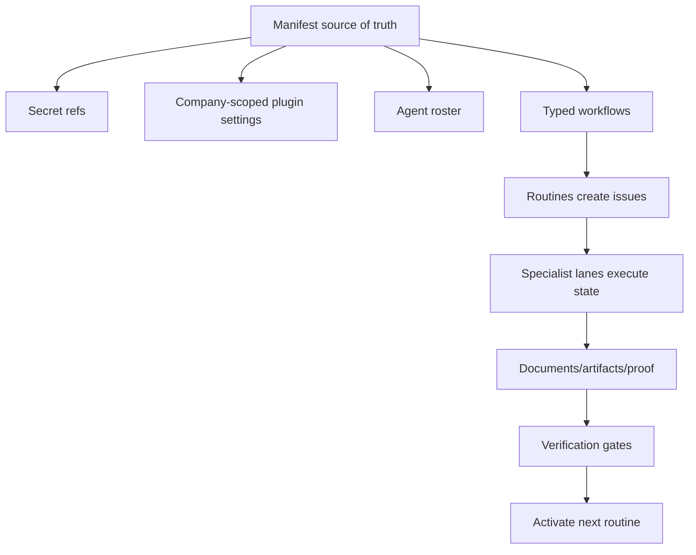

# Phase 40: Clean Astrogen Growth OS Bootstrap - Research

**Date:** 2026-07-02
**Status:** Complete

## Research Question

What needs to be known to plan a clean Astrogen Paperclip operating model that
preserves useful production capability without preserving the old chaos?

## Key Findings

### 1. Clean Instance Is Truly Empty Operationally

The clean instance has the Astrogen company and owner/admin user, but no
operational entities:

```text
agents=0
company_secrets=0
routines=0
plugins=0
```

This is good: Phase 40 can build from a manifest instead of deleting or
untangling old state.

### 2. Old Live State Is Useful As Evidence, Not As Source Of Truth

The old live Astrogen state contains the right broad categories of agents and
plugins, but it also includes:

- terminated smoke agents;
- legacy/do-not-use agents;
- shared/global plugin config;
- historical blocked tasks;
- agent prompt patches accumulated across incidents;
- heartbeat config that does not match the desired token-cost model.

Conclusion: use old live as an inventory source and test oracle, not as a dump
to restore.

### 3. Company-Scoped Plugin Config Is Mandatory

Astrogen credentials and project scopes are company-specific:

- Payload CMS base URL/API key;
- GSC/GA4 site/property and MCP token;
- CrawlObserver project/API key;
- Telegram bot/chat config;
- OpenRouter text/image keys;
- SEO report email sender/recipients;
- provider search keys.

Global plugin config is acceptable only for package-level defaults that are not
company/project credentials. The clean design should prefer company settings or
company secret refs and should reject cross-company credential leakage.

### 4. Minimal Agent Set Should Be Layered

The clean roster should not be only "CEO/CMO/CTO" because Astrogen's real work
requires specialist lanes. It also should not recreate every historical agent
as active.

Recommended layers:

| Layer | Agents | Activation |
| --- | --- | --- |
| Governance | `CEO`, `Chief Marketing Officer`, `Chief Technical Officer`, `OPS Human Interaction Agent`, `OPS Observability Agent` | active, wake-on-demand only |
| SEO/GEO evidence | `SEO Performance Analyst`, `SEO GSC Indexing Auditor`, `SEO Semantic Core Strategist`, `SEO Semantic Core Validator` | active after plugin smoke |
| Article production | `SEO Blog Content Strategist`, `SEO Blog Content Plan Validator`, `MKT Blog Brief Strategist`, `SEO Blog Article Writer (Claude)`, `SEO Blog Article Writer (ChatGPT)`, `SEO Blog Article Validator`, `SEO Blog Humanizer`, `SEO Blog Article Layout Editor`, `SEO Blog Article Layout Validator`, `SEO Blog Image Runtime Executor`, `SEO CMS Technical Fixer` | active after article dry run |
| Growth strategy | `MKT Product Discovery Analyst`, `MKT Growth Strategy Architect`, optional `MKT Competitive Intelligence Analyst` | active, assigned only by explicit issues |
| Future paid/social | `ADS Paid Ads Copy Strategist`, `SOC Instagram Account Auditor`, `SOC Instagram Content Strategist`, `SOC Instagram Content Plan Validator`, `SOC Social Content Strategist` | created parked or manifest-only, no routines |
| Excluded | smoke agents, `MKT Legacy PFB Hypothesis Analyst`, `Stage 65 Image Runtime Specialist`, external single-use gateway agents | do not recreate |

### 5. Typed Workflow State Machines Are The Main Architecture Change

The old system relied too much on prompts explaining what should happen. The
clean system should encode work cycles as typed workflow contracts:

- named states;
- allowed transitions;
- required artifacts/evidence per transition;
- owner/assignee for each state;
- retry policy;
- blocked/review posture;
- cost controls;
- completion gate.

Agents should execute the state they own, not reinterpret the whole operating
system from a long prompt.

### 6. Token Cost Model Should Be Built In

Cost reduction should not depend on agents "being careful".

Required controls:

- no idle timer LLM polling;
- routines create concrete issues, not generic manager heartbeats;
- deterministic discovery/normalization/dedupe in plugins/scripts;
- LLM only for interpretation, writing, validation, or strategy;
- batch-first LLM calls for keyword/opportunity evaluation;
- small issue context packets and typed documents instead of replaying long
  comment threads;
- watchdogs wake at most bounded actionable work, not everyone.

### 6.1 Critical Cycle Review

The first Phase 40 plan still described several recurring actions as if a
scheduled routine should wake an LLM-owning manager directly. That is the main
failure mode to remove. A routine should not mean "ask an agent if there is
anything to do"; it should mean "a deterministic trigger created one bounded
piece of work with a known input set, quota, and completion gate."

Corrected cycle architecture:

- deterministic collectors gather CMS, sitemap, GSC/GA4, CrawlObserver, and
  URL-inspection evidence before an LLM sees anything;
- LLM agents receive compact evidence packets only when there is a concrete
  decision, article slot, validation, or strategy task;
- expensive cycles must not use `always_enqueue`;
- expensive cycles must not use `enqueue_missed_with_cap` unless a human
  explicitly approves a one-time catch-up window with a cap and budget;
- article cadence is a slot allocator, not a "catch up every missed article"
  machine;
- daily URL indexing audit is due-URL based with quotas and cooldowns, not a
  full-site LLM review;
- weekly SEO/GEO analysis must close with an action queue, watch/cooldown
  decisions, or explicit "no action" evidence;
- paid ads, social, and backlink/provider work remain parked until explicit
  enablement because they can spend money or create external obligations.

The clean instance should therefore bootstrap all recurring routines as
`paused` with disabled triggers. Activation is a separate smoke gate after the
plugin config, secret refs, and workflow contract have been verified.

### 7. Current Tasks Need Transition, Not Full Migration

Old live has only a small current actionable surface but a large blocked/history
surface. Clean rebuild should create a transition issue set for only:

- active `todo` / `in_progress` / `in_review` work that still matters;
- blocked work that is still strategically valid and has a non-obsolete unblock
  path;
- active routines that should continue in the clean instance.

Do not import old `done`, `cancelled`, stale blocked, smoke, or diagnostic-only
issues.

## Proposed Clean Architecture



## Workflow Set

### Semantic Core Lifecycle

```text
project_registered
-> layer_requested
-> mcp_run_started
-> import_prepared
-> review_ready
-> review_decided
-> imported
-> opportunities_created
-> monitoring_enrolled
```

### SEO Performance Loop

```text
scheduled
-> collect_cms_sitemap_gsc_ga4_crawl
-> normalize_and_dedupe
-> join_evidence
-> classify_actions
-> route_child_issues
-> detailed_report_document
-> compact_telegram_summary
-> monitoring_window
```

### Article Cadence

```text
scheduled_or_requested
-> opportunity_selected
-> brief_created
-> brief_validated
-> article_written
-> article_validated
-> humanized
-> layout_created
-> layout_validated
-> image_created
-> cms_draft_created
-> owner_notified
-> monitoring_enrolled
```

### Technical SEO Finding

```text
detected
-> evidence_attached
-> deduped
-> route_selected
-> fix_assigned
-> fixed
-> verified
-> monitored
```

### Human Decision / Telegram

```text
decision_needed
-> decision_brief_documented
-> interaction_or_telegram_sent
-> waiting_for_answer
-> answer_written_back
-> source_issue_resumed
```

### Product Launch SEO Package

```text
product_detected
-> product_discovery
-> strategic_opportunity_brief
-> human_approval_if_needed
-> semantic_seed
-> beginner_content_package
-> seo_traffic_package
-> internal_linking_plan
-> monitoring_enrolled
```

### Paid/Social Readiness

```text
parked
-> explicit_enablement_decision
-> credentials_scope_verified
-> plan_created
-> human_approval
-> execution
```

This workflow exists in the manifest but remains inactive in Phase 40.

## Verification Architecture

Phase 40 should pass only when:

- clean manifest can be diffed against the clean instance;
- no manifest contains secret values;
- all required secrets exist as refs in the clean company;
- required plugins are installed and ready;
- company-scoped plugin settings exist for Astrogen;
- core agents exist with no idle timer polling;
- typed workflows/routines exist disabled first;
- no expensive LLM routine has catch-up or always-enqueue behavior;
- plugin smoke tests pass before routine activation;
- at least one dry-run issue proves the article path and SEO evidence path can
  progress through the right states;
- old live remains untouched until the human chooses cutover.

## Residual Open Questions For Execution

- Whether the current Paperclip API exposes all needed plugin/secret/routine
  writes or whether Phase 40 needs a bounded server-side bootstrap utility.
- Whether paid/social parked agents should be physically created now or kept as
  manifest-only definitions.
- Which exact old live active tasks should be carried into the clean transition
  pack after a fresh issue-level audit.
